# Disaster Recovery Automation (Warm Standby)

This project demonstrates a complete **Disaster Recovery (DR) Automation Workflow** using **LocalStack**, simulating AWS services such as S3, Lambda, and Route53 without incurring any real AWS cost.

The goal is to showcase:
- High Availability (HA) & Disaster Recovery (DR) concepts
- Cross-region replication (simulated)
- Infrastructure restore automation using Lambda
- DNS failover using Route53
- A realistic DR runbook flow

All AWS actions are fully emulated locally.

---

# Architecture Overview

Pilot Light DR strategy means a minimal version of the environment is always running in the DR region, while full infrastructure is restored only during a disaster.

This project simulates:
- **Source region (us-east-1)** – production-like region
- **DR region (us-west-2)** – minimal DR infrastructure
- **S3** – replicated buckets
- **AMI + RDS snapshots** – simulated metadata
- **Lambda** – restores infrastructure on demand
- **Route53** – failover DNS records

---

# Step 1 — Start LocalStack

LocalStack simulates AWS APIs locally.

```bash
docker compose up -d
```

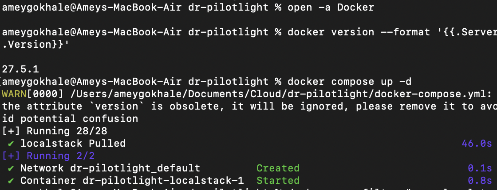

---

# Step 2 — Configure Local AWS CLI Profile

```bash
aws configure --profile localstack
# Access Key: test
# Secret Key: test
# Region: us-east-1
# Output: json

export AWS_PROFILE=localstack
export AWS_ENDPOINT_URL=http://localhost:4566
```

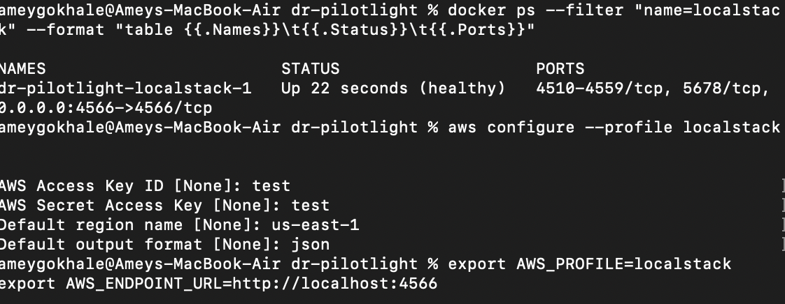

---

# Step 3 — Create S3 Buckets (Primary & DR)

### Create primary bucket
```bash
aws --endpoint-url=$AWS_ENDPOINT_URL s3 mb s3://myapp-source-bucket
```

### Create DR bucket (must specify region)
```bash
aws --endpoint-url=$AWS_ENDPOINT_URL s3api create-bucket \
  --bucket myapp-dr-bucket \
  --create-bucket-configuration LocationConstraint=us-west-2 \
  --region us-west-2
```

### Upload sample file
```bash
aws --endpoint-url=$AWS_ENDPOINT_URL s3 cp index.html s3://myapp-source-bucket/index.html
```

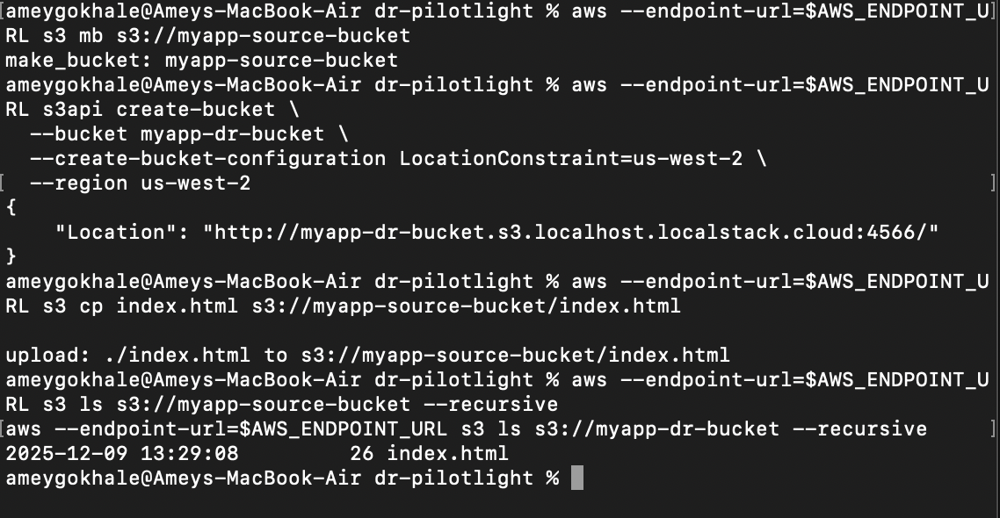

---

# Step 4 — Sync S3 Buckets (Simulated Cross-Region Replication)

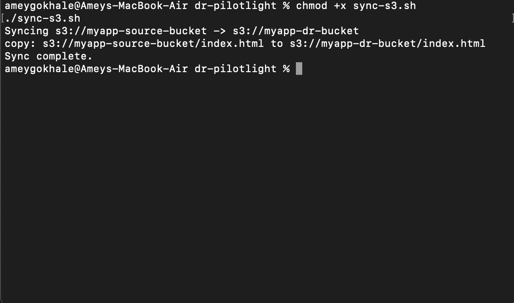 (Simulated Cross-Region Replication)

 (Simulated Cross-Region Replication)

```bash
aws --endpoint-url=$AWS_ENDPOINT_URL s3 sync s3://myapp-source-bucket s3://myapp-dr-bucket
```

This simulates S3 Cross-Region Replication (CRR).

---

# Step 5 — Prepare Lambda Invoke Payload

Your lambda trigger input:
```json
{
  "src_bucket": "myapp-source-bucket",
  "dr_bucket": "myapp-dr-bucket",
  "snapshot_id": "rds-snapshot-2025-12-09",
  "ami_id": "ami-demo-123456"
}
```

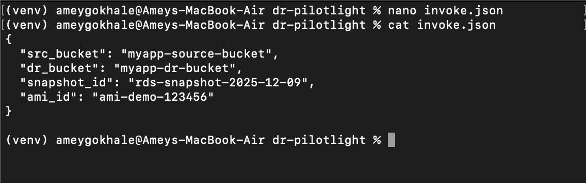

---

# Step 6 — Create and Deploy Lambda Function

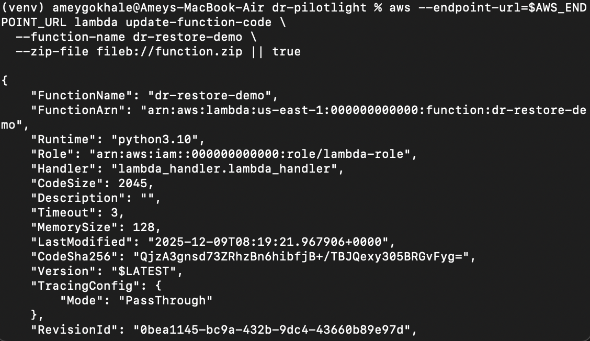


Lambda runs the DR Orchestrator which:
- Copies S3 objects
- Simulates AMI copy and EC2 launch
- Simulates RDS restore

```bash
aws --endpoint-url=$AWS_ENDPOINT_URL lambda create-function \
  --function-name dr-restore-demo \
  --runtime python3.10 \
  --role arn:aws:iam::000000000000:role/lambda-role \
  --handler lambda_handler.lambda_handler \
  --zip-file fileb://function.zip
```

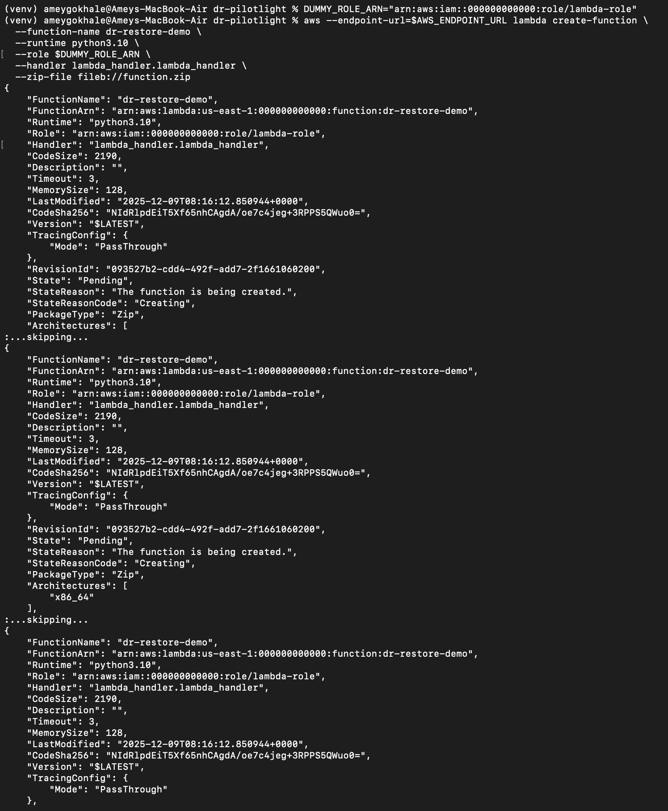

---

# Step 7 — Invoke Lambda

```bash
aws --endpoint-url=$AWS_ENDPOINT_URL lambda invoke \
  --function-name dr-restore-demo \
  --cli-binary-format raw-in-base64-out \
  --payload file://invoke.json out.json
```

View output:
```bash
python3 -m json.tool out.json
```

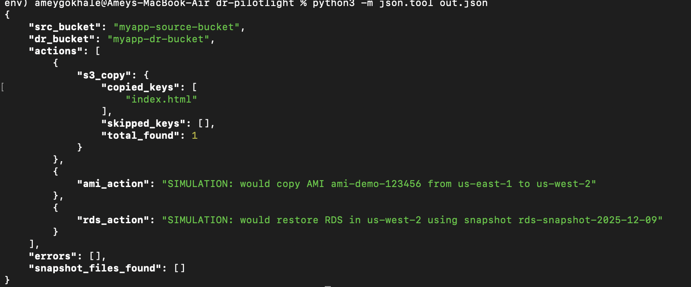
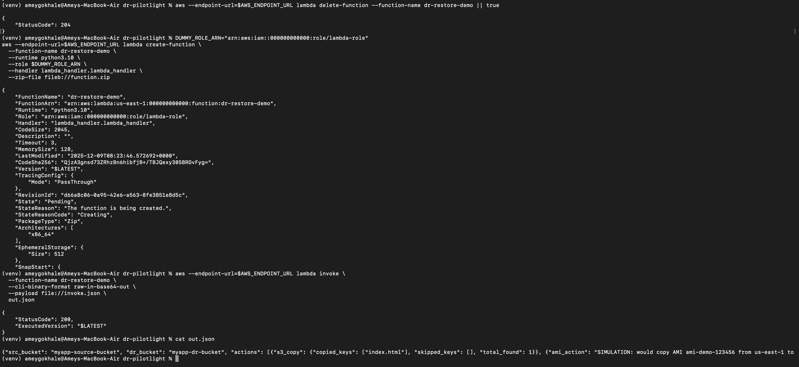

---

# Step 8 — Run Lambda Restore Script Manually (Demo Mode)

```bash
python3 lambda_restore.py
```

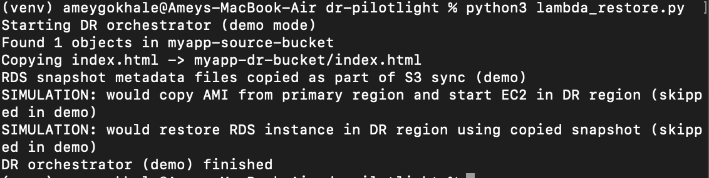

This script:
- Lists objects in source bucket
- Copies them to DR bucket
- Simulates AMI & RDS restore workflows

---

# Step 9 — Create Route53 Hosted Zone

```bash
aws --endpoint-url=$AWS_ENDPOINT_URL route53 create-hosted-zone \
  --name dr-demo.example.com \
  --caller-reference $(date +%s) > hosted-zone.json
```

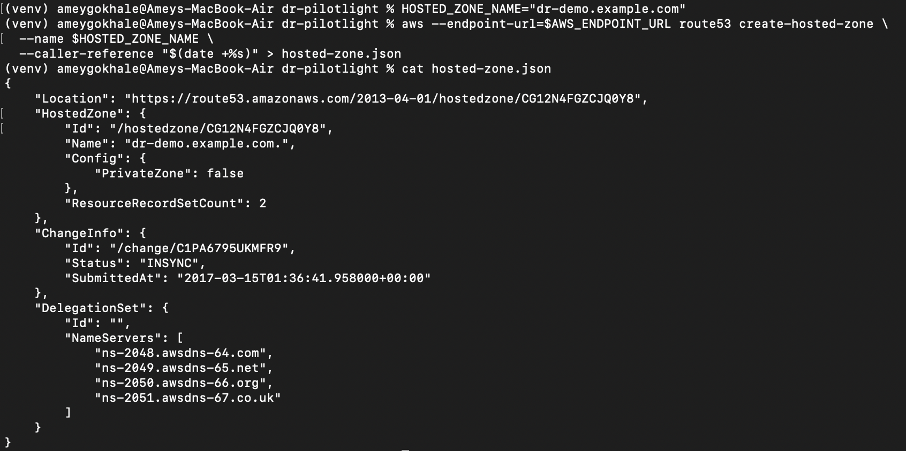

---

# Step 10 — Create DNS Failover Records

PRIMARY → 10.0.0.1  
SECONDARY → 10.0.1.1

```bash
aws --endpoint-url=$AWS_ENDPOINT_URL route53 change-resource-record-sets \
  --hosted-zone-id $HOSTED_ZONE_ID \
  --change-batch file://route53-change.json
```

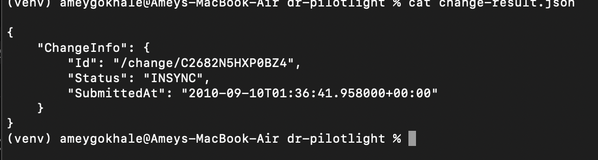

---

# Cleanup

Since everything runs in LocalStack:
```bash
docker compose down
```

Optional full cleanup:
```bash
docker volume prune -f
rm -rf dr-pilotlight
```

---

# Summary

You built a full **Disaster Recovery Automation System** locally using AWS-like APIs without spending anything.
