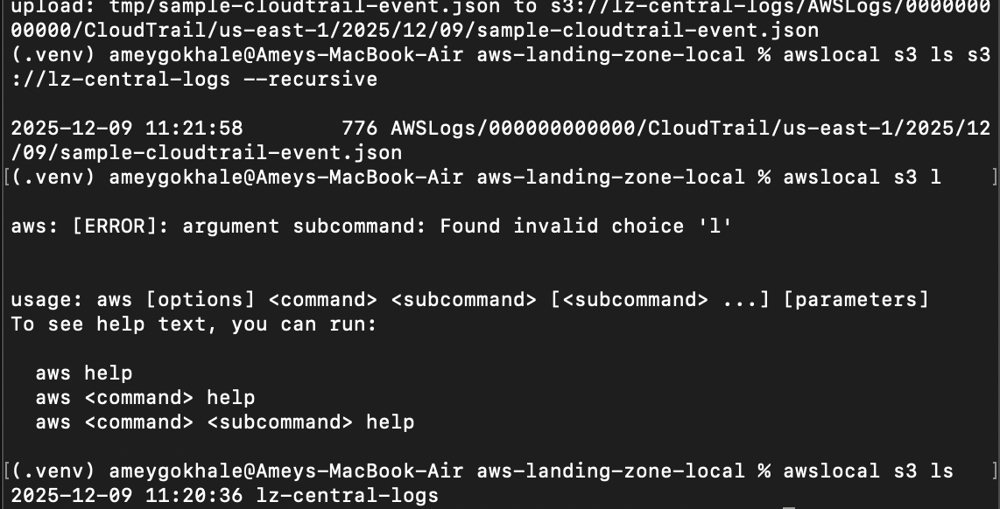
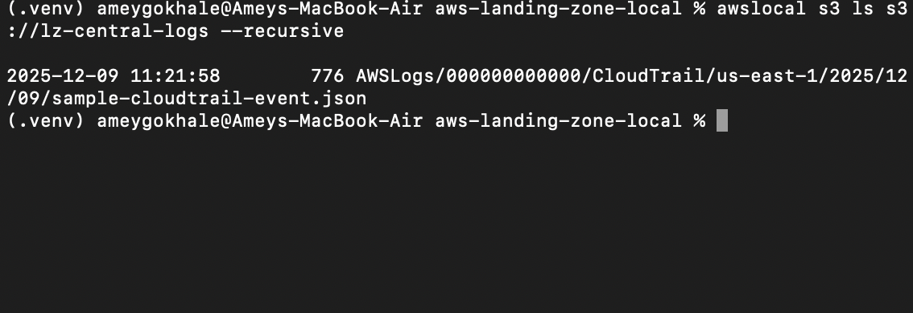
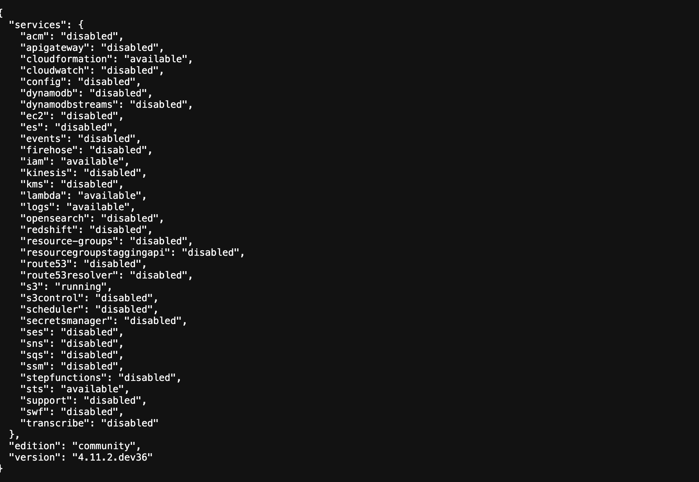
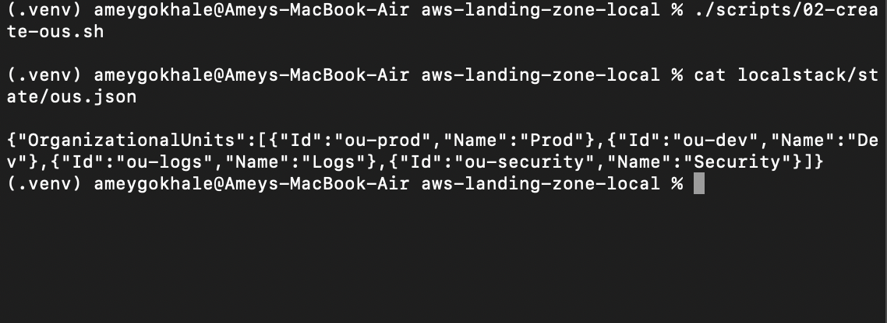
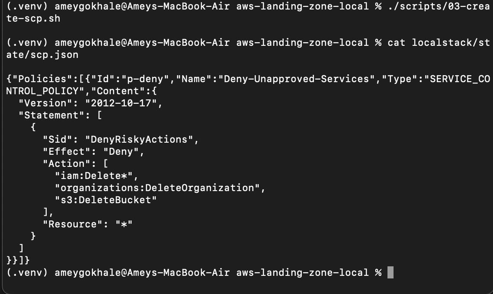
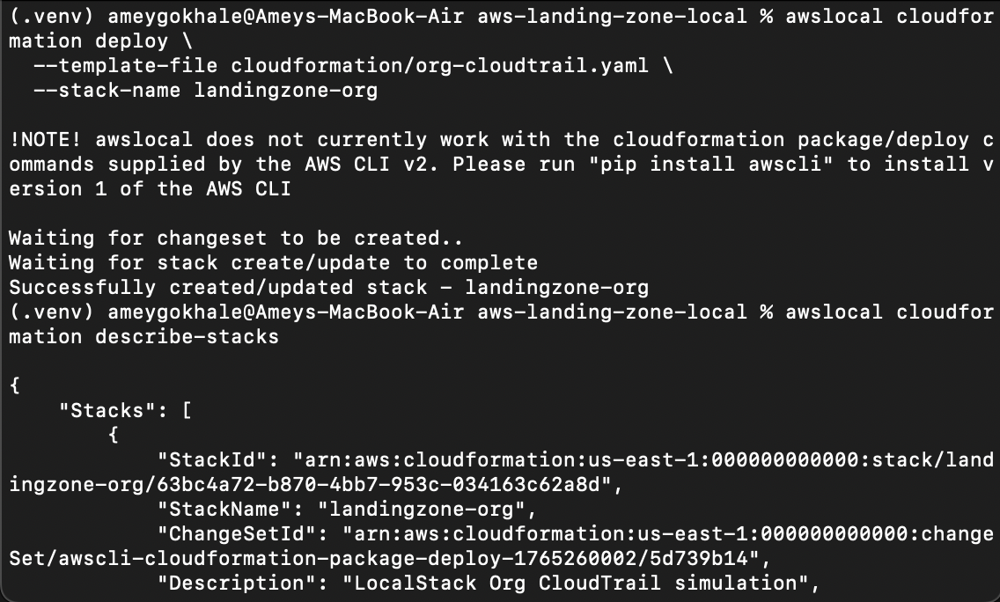

# Multi-Account AWS Landing Zone

This project demonstrates an **enterprise-grade AWS Landing Zone architecture** — implemented entirely using **LocalStack**, meaning you can practice and showcase a multi-account AWS governance setup **without paying for AWS services**.

This project replicates those concepts locally while keeping everything **free, reproducible, and safe**.

---

# **What This Project Implements**

### 1. Organizational Units (Simulated via state files)
- `Prod`
- `Dev`
- `Logs`
- `Security`

### 2. Service Control Policies (SCPs)
A realistic **deny policy** blocking dangerous operations, stored in `localstack/state/scp.json`.

### 3. Centralized CloudTrail (Simulated)
- S3 bucket for logs: `lz-central-logs`
- Manually uploaded CloudTrail-style log file (since CloudTrail APIs require LocalStack Pro)

### 4. CloudFormation
Successfully deployed stack using LocalStack CloudFormation, demonstrating IaC discipline.

### 5. AWS CLI + awslocal Automation  
All functionality controlled via:
- `scripts/01-create-organization.sh`
- `scripts/02-create-ous.sh`
- `scripts/03-create-scp.sh`
- `scripts/04-create-cloudtrail.sh` (bucket + simulated logs)

---

# **Theory: What Is a Landing Zone?**

A **Landing Zone** is a preconfigured, secure, multi-account AWS environment used by enterprises. It automates:

### **1. Governance**
- OUs organize accounts by function.
- SCPs prevent risky operations (e.g., deleting IAM, leaving the org).

### **2. Security**
- Centralized CloudTrail for tamper-proof visibility.
- Logs stored in a dedicated, locked-down account.

### **3. Scalability**
- Each team or workload lives in its own AWS account.
- Isolation improves blast-radius control and billing clarity.

### **4. Compliance**
- Enterprise guardrails ensure regulatory alignment (PCI, HIPAA, SOC2).

This repo shows you understand these concepts even without deploying to real AWS.

---

# **How to Run the Project Locally**

### **1. Start LocalStack**
```bash
docker-compose up -d
```

Visit the health dashboard:  
http://localhost:4566/_localstack/health

---

### **2. Create a virtual environment**
```bash
python3 -m venv .venv
source .venv/bin/activate
pip install awscli-local
```

---

### **3. Run setup scripts**
```bash
chmod +x scripts/*.sh

./scripts/01-create-organization.sh
./scripts/02-create-ous.sh
./scripts/03-create-scp.sh
```

---

### **4. Create S3 bucket + simulated CloudTrail**
```bash
mkdir -p tmp
awslocal s3 mb s3://lz-central-logs
awslocal s3 cp tmp/sample-cloudtrail-event.json s3://lz-central-logs/AWSLogs/.../sample-cloudtrail-event.json
```

---

### **5. Deploy CloudFormation**
```bash
awslocal cloudformation deploy   --template-file cloudformation/org-cloudtrail.yaml   --stack-name landingzone-org
```

---

# **Screenshots (All stored under `/images/`)**

These screenshots demonstrate the working environment.

### **1️⃣ LocalStack Dashboard**  


### **2️⃣ S3 Buckets (Central Logging Bucket)**  


### **3️⃣ CloudTrail Logs in S3 (Simulated)**  


### **4️⃣ OU JSON (Simulated Organizational Units)**  


### **5️⃣ SCP JSON (Guardrails Policy)**  


### **6️⃣ Architecture Diagram (Landing Zone Overview)**  
                ┌───────────────────────────────────┐
                │        AWS ORGANIZATIONS          │
                │───────────────────────────────────│
                │   Prod   |   Dev   | Logs | Sec   │
                └───────────────────────────────────┘
                           │
                           ▼
                ┌─────────────────────┐
                │ Central CloudTrail  │ (simulated)
                └─────────────────────┘
                           │
                           ▼
                ┌─────────────────────┐
                │ Central Log Bucket  │
                └─────────────────────┘
                           │
                           └──> SCP Guardrails


### **CloudFormation Successful Deployment**  


---

# 🏁 **Conclusion**

This repository is a **full, local, zero-cost simulation** of an enterprise AWS Landing Zone.  
It demonstrates knowledge that cloud engineers use daily:

- Governance  
- IAM/SCPs  
- Multi-account patterns  
- Security logging  
- Infrastructure-as-Code  
- Automation scripting  

This makes it a **strong portfolio project** for showcasing real-world cloud engineering skills.
