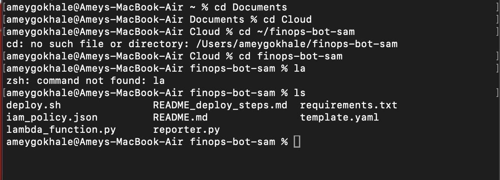
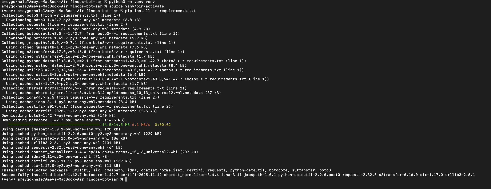
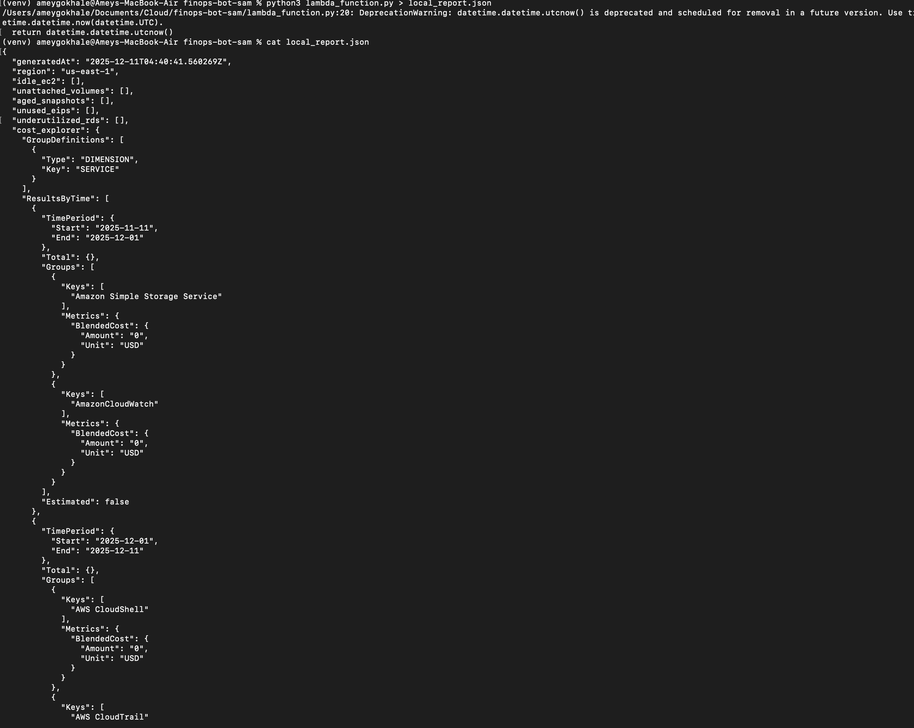
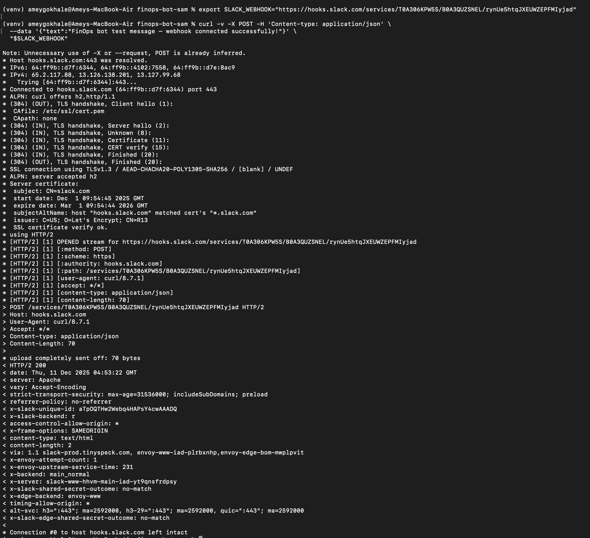
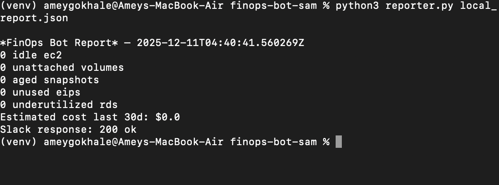

# FinOps Cost Optimization & Automation Bot

This project implements a **complete, zero-cost, locally runnable FinOps automation bot** that scans your AWS account for:

- Idle EC2 instances
- Unattached EBS volumes
- Aged snapshots
- Underutilized RDS instances
- Unused Elastic IPs
- AWS Cost Explorer 30-day spend summary

It then generates a report and sends it to Slack using an **Incoming Webhook**.

You successfully:
- Created the virtual environment
- Installed dependencies
- Generated the cost + resource optimization report
- Configured the Slack webhook
- Verified Slack connectivity via curl
- Executed the reporter and confirmed Slack delivery

This README documents **the theory, setup steps, commands, and screenshots** associated with the project. All screenshots are stored in a folder named `images/`.

---

# Theory Overview

Modern cloud environments accumulate cost waste from:
- Always-running EC2 instances
- Accidental unattached EBS volumes
- Snapshots retained longer than needed
- RDS instances sized incorrectly
- Elastic IPs that incur cost when unused

FinOps principles focus on:
1. **Visibility** — Knowing what is costing money
2. **Optimization** — Identifying waste
3. **Automation** — Eliminating manual cost checks

This bot demonstrates FinOps automation ability using:
- `boto3` to query AWS resources
- CloudWatch metrics to detect underutilization
- Cost Explorer API for cost visibility
- Slack webhooks for automated reporting

This is a **portfolio-ready project** that showcases:
- Cloud automation
- AWS SDK usage
- Practical cost optimization
- Real business value

---

# Local Setup (No Cloud Charges)

## Extract the Project
Navigate to the folder where the with the code:

```
cd ~/finops-bot-sam
```

### Screenshot


---

## Create and Activate Virtual Environment
```bash
python3 -m venv venv
source venv/bin/activate
```

---

## Install Dependencies
```bash
pip install -r requirements.txt
```

### Screenshot


---

# Running the Scanner Locally

Run the main scanner (this does NOT change or delete anything):

```bash
python3 lambda_function.py > local_report.json
cat local_report.json
```

### Screenshot


This file contains your:
- Detected idle resources
- Cost Explorer results
- Underutilization metrics

---

# Slack Webhook Setup + Testing

## Export your Slack webhook
```bash
export SLACK_WEBHOOK="https://hooks.slack.com/services/XXXX/XXXX/XXXX"
```

## Test connectivity using curl
```bash
curl -v -X POST -H 'Content-type: application/json' \
  --data '{"text":"FinOps bot test message — webhook connected successfully!"}' \
  "$SLACK_WEBHOOK"
```

### Screenshot


Expected output:
```
HTTP/2 200
ok
```

---

# Send the FinOps Report to Slack

```bash
python3 reporter.py local_report.json
```
Expected output:
```
Slack response: 200 ok
```

### Screenshot


Slack now receives your automated cloud cost optimization report.

---

# Project Files Overview

| File | Purpose |
|------|---------|
| `lambda_function.py` | Core AWS scanner logic (also Lambda handler) |
| `reporter.py` | Slack report generator |
| `requirements.txt` | Python dependencies |
| `template.yaml` | AWS SAM deployment template |
| `deploy.sh` | Optional helper for deploying to AWS Lambda |
| `iam_policy.json` | Read-only IAM permissions used by the scanner |
| `README.md` | Documentation (this file) |

---
